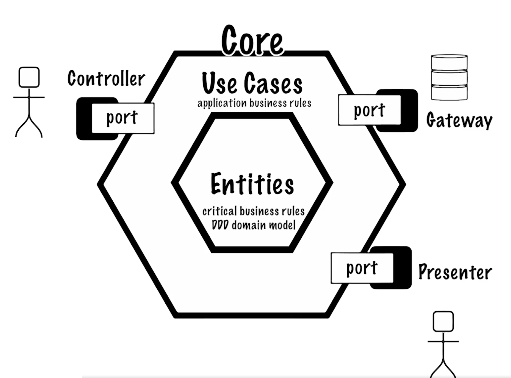

# DDDDemo
*A simplified example playground applying some DDD and Clean Architecture concepts*

## Some principles and motivations for this design choice
- Ubiquitous language - the code should model the business domain as closely and clearly as possible
- The software design should be dictated by the domain and not by the technology or framework used
- Screaming architecture - helps to keep consistency and structure therefore making the code more maintainable
- Encapsulates business domain and isolates it from non-business critical infrastructure such as frameworks and other implementation details
- More testable business domain
- The opposite of "anemic" design where data is kept away from behaviour. DDD brings these two together into rich domain objects

## Some covered topics in this example
- Entities and value objects (see e.g. domain.Client and domain.Amount)
- Use-cases (see e.g. GetClientsUseCase and ClientService)
- Ports and adapters (see adapter package)
- Arch unit tests which enforce defined clean architecture package structure and references (see ArchitectureTests)

**TODO**
- [x] Add a controller and reference unit test using Mock MVC
- [x] Add arch unit tests to verify reference violations
- [ ] Add an integration test (@SpringBootTest) https://www.baeldung.com/spring-boot-testing
- [ ] Try out auto mapping (from adapter to domain, from domain to presenter DTO)
- [ ] Let the ClientService implement a second UC (separate interface)

